# 🚀 ZPKG_ORDER_CLASSIFICATION_CPI
## SAP BTP CPI | Classificação Inteligente de Pedidos com XML Modifier & Groovy

## 📌 Objetivo da solução

Este projeto demonstra o desenvolvimento de um Integration Flow (iFlow) no SAP BTP Integration Suite (CPI), focado no processamento e classificação de pedidos.

A solução recebe um payload XML via HTTP, extrai os dados utilizando XPath, aplica regras de negócio com Groovy e retorna uma resposta XML enriquecida.

### 🎯 Cenário

Um sistema backend envia dados de pedidos que devem ser:

✅ Validados   
📊 Classificados com base no valor   
🔄 Enriquecidos com informações de processamento    

<br>


---

<br>

# 🏗️ 🔧 Arquitetura do iFlow

<br><br>

# 🔄 1. Fluxo da Integração

<br>

### 🧱 Criando o Package
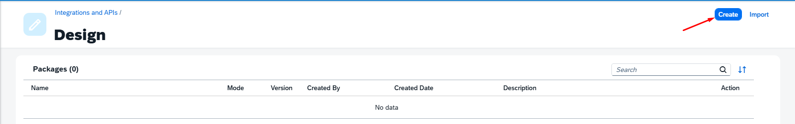

<br><br>

### 🏷️ Nome do Package
```
ZPKG_ORDER_CLASSIFICATION
```
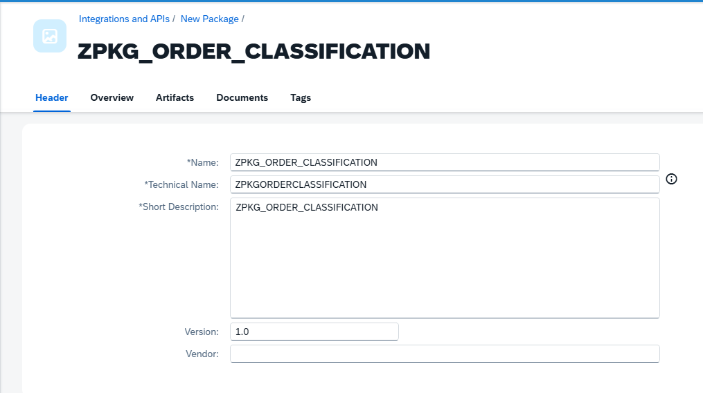

<br>

### ➕ Adicionando o Artefato
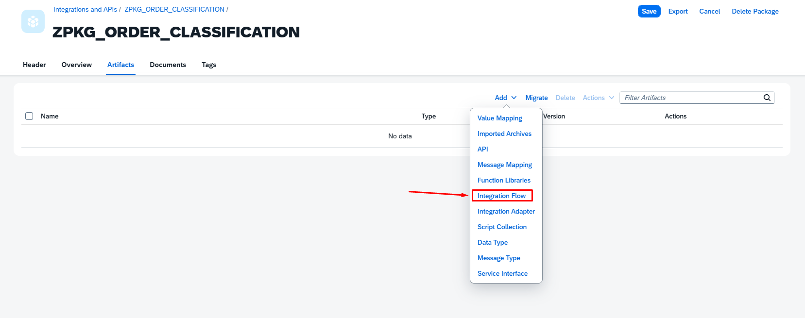

<br>

### 🏷️ Nome do iFlow
```
IFL_ORDER_CLASSIFICATION_XMLMODIFIER
```
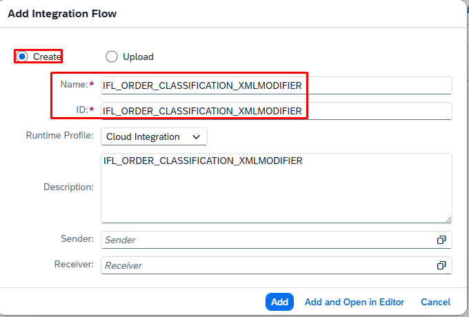

<br>

### ➕ Adicionando o Adapter
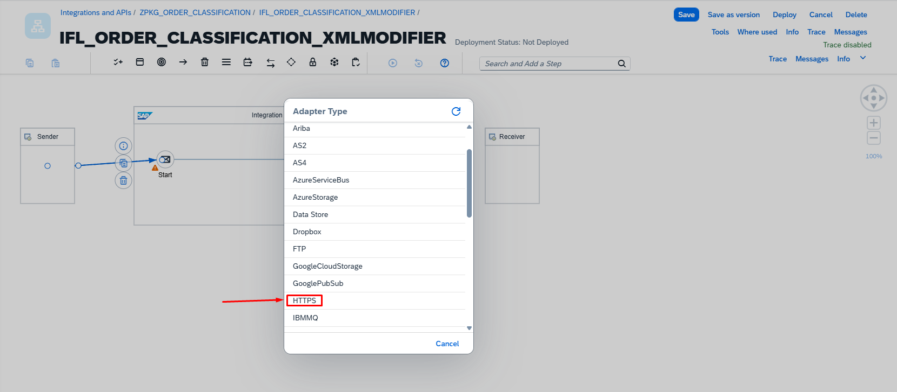

<br> 

# 🔹 2. HTTPS Sender (Trigger)
```
Endpoint: /order/classify
```
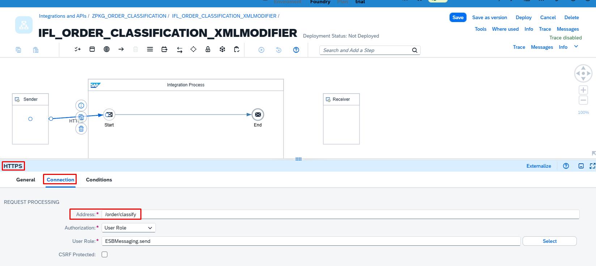

<br>

# 🔹 3. Content Modifier

### ➕ Adicionando o Content Modifier
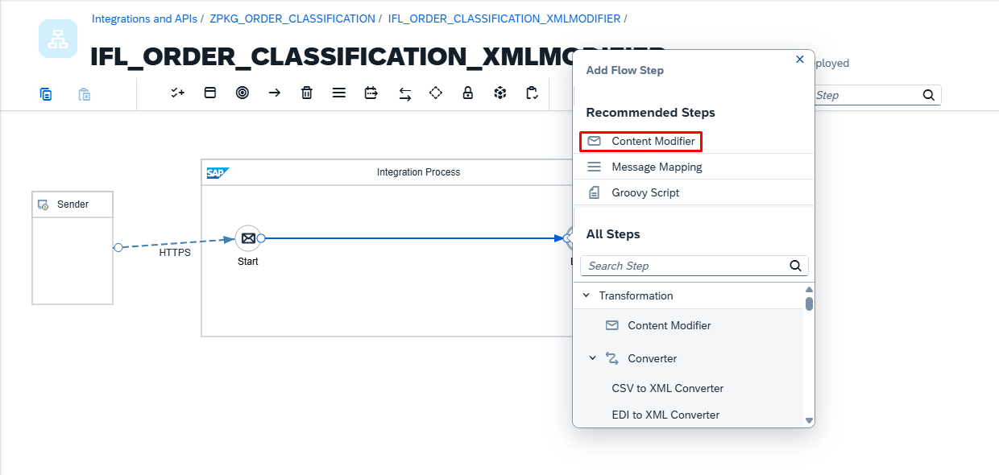

<br>

### 🏷️ Renomeando o Content Modifier
```
Nome: CM_setProperty
```
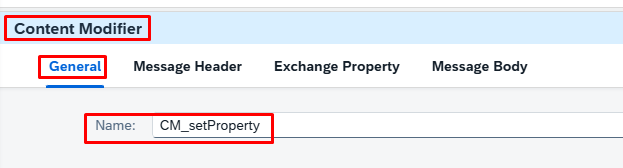


<br>

### ⚙️ Configuração do Content Modifier
📩 Exchange Properties
```
| Name        | Source Type | Source Value        | Data Type        |
|-------------|-------------|---------------------|------------------|
| status      | Constant    | {{PROCESSED}}       |                  |
| orderId     | XPath       | /Order/OrderID      | java.lang.String |
| customerId  | XPath       | /Order/CustomerID   | java.lang.String |
| amount      | XPath       | /Order/Amount       | java.lang.String |
| region      | XPath       | /Order/Region       | java.lang.String |

```
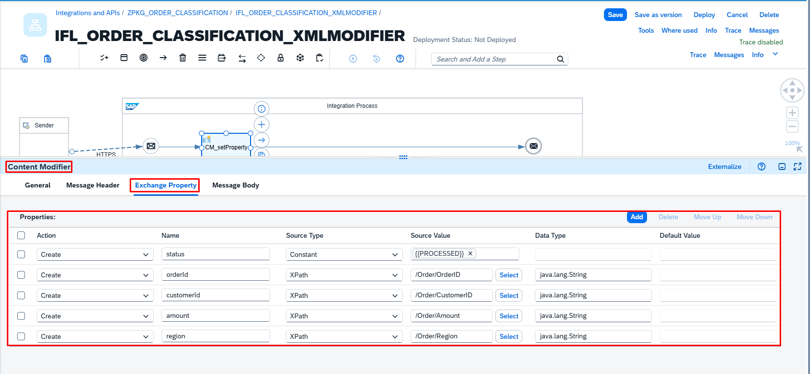

<br>

### ⚙️ Externalização de Parâmetros

O parâmetro abaixo foi externalizado para facilitar manutenção e reutilização do iFlow:

| Parâmetro  | Valor Padrão |
|------------|--------------|
| PROCESSED  | PROCESSED    |

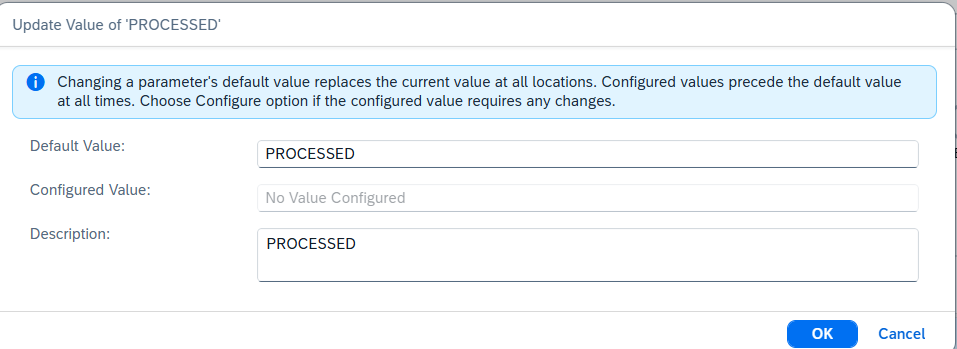

<br>

# 🔹 3. Groovy Script
Classifica o pedido com base no valor:

- LOW → BAIXO   
- MEDIUM → MÉDIO
- HIGH → ALTO

### ➕ Adicionando Groovy Script
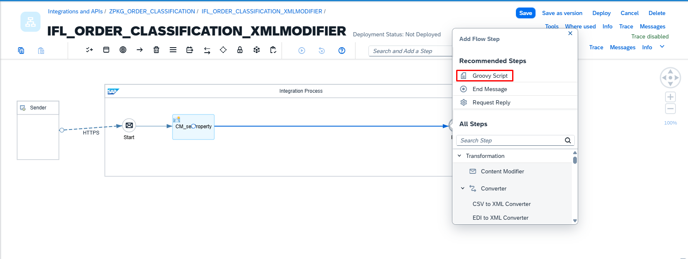

<br>

### 🏷️ Renomeando o Groovy Script
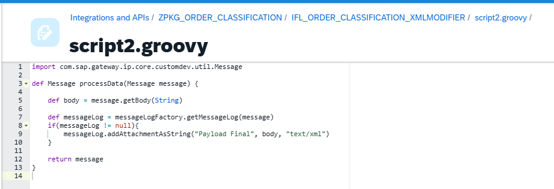
```
GS_Classificacao
```

<br>

### ➕ Adicionando Groovy Script
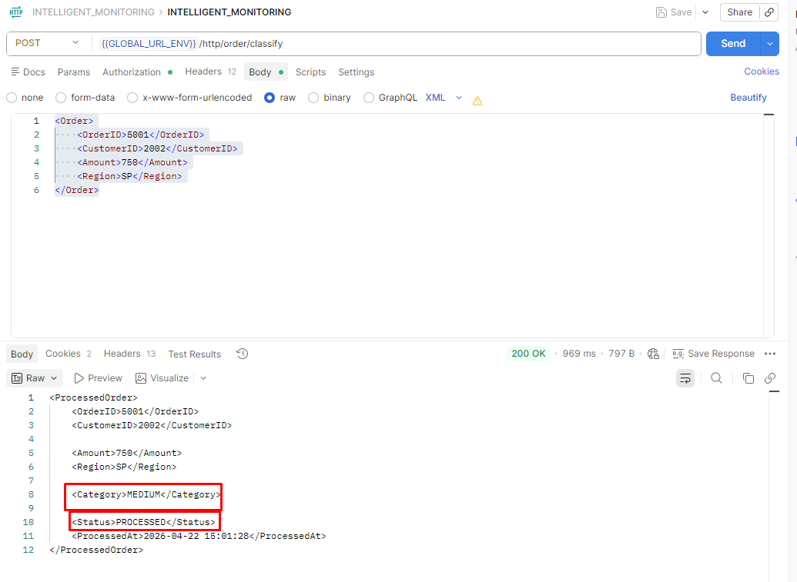

<br>

Classifies order based on amount:
LOW
MEDIUM
HIGH


📥 Input Payload
<Order>
    <OrderID>5001</OrderID>
    <CustomerID>2002</CustomerID>
    <Amount>750</Amount>
    <Region>SP</Region>
</Order>


3. Content Modifier (Build Response)
Constructs final XML response
Adds timestamp and status
4. Logging (Groovy)
Logs final payload in Message Monitoring
📤 Output Payload
<ProcessedOrder>
    <OrderID>5001</OrderID>
    <CustomerID>2002</CustomerID>
    <Amount>750</Amount>
    <Region>SP</Region>
    <Category>MEDIUM</Category>
    <Status>PROCESSED</Status>
    <ProcessedAt>2026-04-22 10:00:00</ProcessedAt>
</ProcessedOrder>

🧠 Key Features
✔️ XPath-based data extraction   
✔️ Business rules with Groovy Script   
✔️ XML transformation using Content Modifier   
✔️ Payload logging for monitoring   
✔️ Parameter externalization ready   
💡 Technical Highlights

Separation of concerns (Extraction vs Logic vs Transformation)
Use of Exchange Properties for stability
Avoidance of inline XPath in XML (best practice)

🚀 Endpoint   
POST /order/classify
🧪 How to Test (Postman)
Method: POST
URL: /order/classify
Body: XML
Send request and validate response


📷 Preview   

Add your iFlow screenshot here
