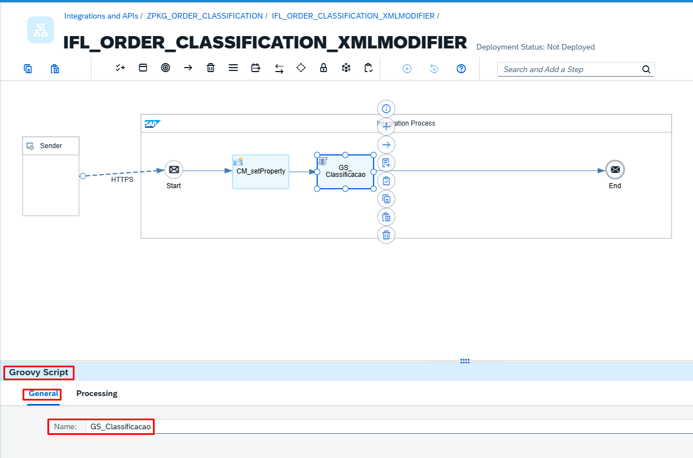
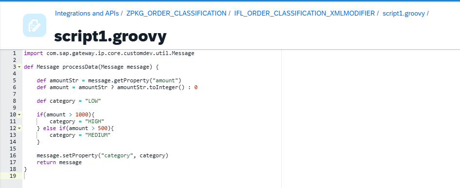
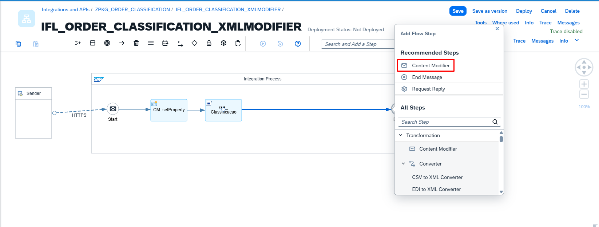
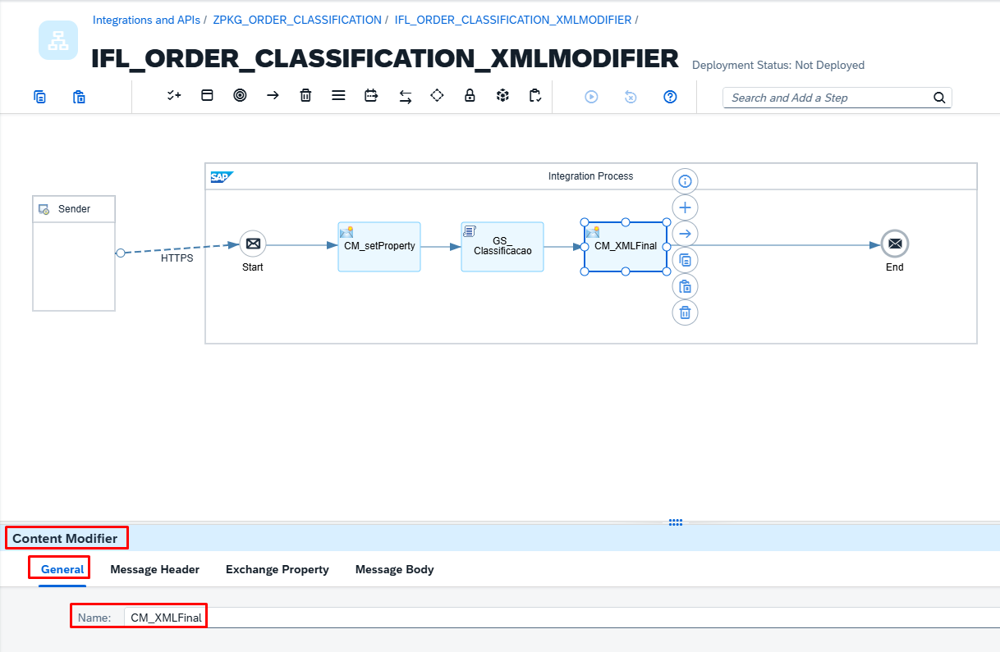
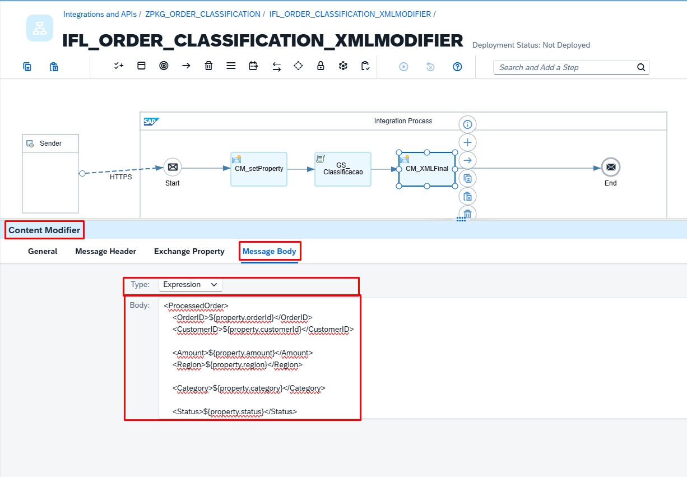
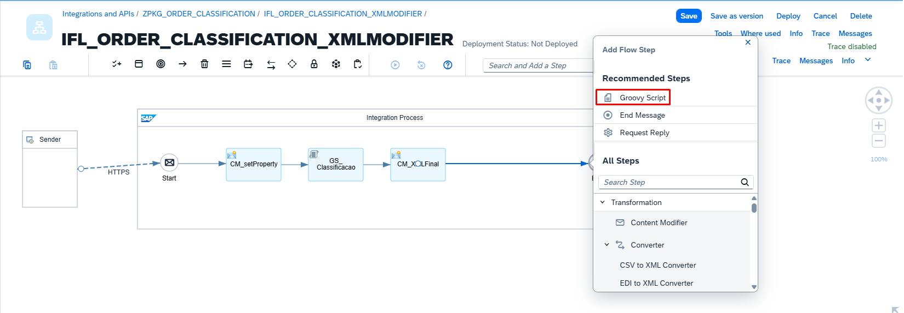
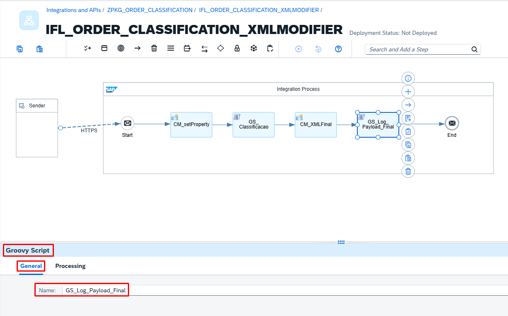
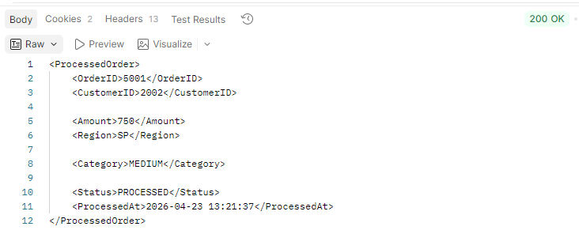
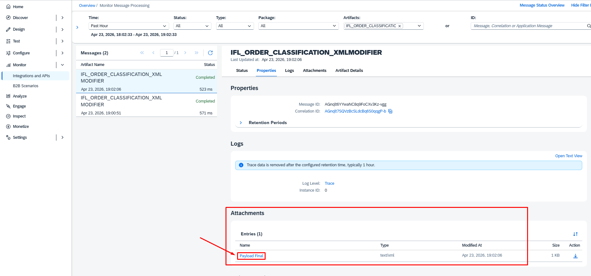

# 🚀 ZPKG_ORDER_CLASSIFICATION_CPI
## SAP BTP CPI | Classificação Inteligente de Pedidos com XML Modifier & Groovy

## 📌 Objetivo da solução

Este projeto demonstra o desenvolvimento de um Integration Flow (iFlow) no SAP BTP Integration Suite (CPI), focado no processamento e classificação de pedidos.

A solução recebe um payload XML via HTTP, extrai os dados utilizando XPath, aplica regras de negócio com Groovy e retorna uma resposta XML enriquecida.

### 🎯 Cenário

Um sistema backend envia dados de pedidos que devem ser:

✅ Validados   
📊 Classificados com base no valor   
🔄 Enriquecidos com informações de processamento    

<br>


---

<br>

# 🏗️ 🔧 Arquitetura do iFlow

<br><br>

# 🔄 1. Fluxo da Integração

<br>

### 🧱 Criando o Package


<br><br>

### 🏷️ Nome do Package
```
ZPKG_ORDER_CLASSIFICATION
```


<br>

### ➕ Adicionando o Artefato


<br>

### 🏷️ Nome do iFlow
```
IFL_ORDER_CLASSIFICATION_XMLMODIFIER
```


<br>

### ➕ Adicionando o Adapter


<br> 

# 🔹 2. HTTPS Sender (Trigger)
```
Endpoint: /order/classify
```


<br>

# 🔹 3. Content Modifier

### ➕ Adicionando o Content Modifier


<br>

### 🏷️ Renomeando o Content Modifier
```
Nome: CM_setProperty
```


<br>

### ⚙️ Configuração do Content Modifier
📩 Exchange Properties
```
| Name        | Source Type | Source Value        | Data Type        |
|-------------|-------------|---------------------|------------------|
| status      | Constant    | {{PROCESSED}}       |                  |
| orderId     | XPath       | /Order/OrderID      | java.lang.String |
| customerId  | XPath       | /Order/CustomerID   | java.lang.String |
| amount      | XPath       | /Order/Amount       | java.lang.String |
| region      | XPath       | /Order/Region       | java.lang.String |

```


<br>

### ⚙️ Externalização de Parâmetros

O parâmetro abaixo foi externalizado para facilitar manutenção e reutilização do iFlow:

| Parâmetro  | Valor Padrão |
|------------|--------------|
| PROCESSED  | PROCESSED    |


<br>

# 🔹 4. Groovy Script
Classifica o pedido com base no valor:

- LOW → BAIXO   
- MEDIUM → MÉDIO
- HIGH → ALTO

### ➕ Adicionando Groovy Script


<br>

### 🏷️ Renomeando o Groovy Script

```
GS_Classificacao
```

<br>

### ➕ Lógica do ordem de classificação
```
import com.sap.gateway.ip.core.customdev.util.Message

def Message processData(Message message) {

    def amountStr = message.getProperty("amount")
    def amount = amountStr ? amountStr.toInteger() : 0

    def category = "LOW"

    if(amount > 1000){
        category = "HIGH"
    } else if(amount > 500){
        category = "MEDIUM"
    }

    message.setProperty("category", category)
    return message
}
```



<br>

# 🔹 5. Content Modifier

### ➕ Adicionando o Content Modifier


<br>

### 🏷️ Renomeando o Content Modifier
```
Nome: CM_XMLFinal
```



<br>

### ⚙️ Configuração do Content Modifier
Construindo a resposta final em XML
Adiciona timestamp (data/hora) e status   

📩 Message Body
- **Type:** Expression  
- **Body:**
```
<ProcessedOrder>
    <OrderID>${property.orderId}</OrderID>
    <CustomerID>${property.customerId}</CustomerID>
    
    <Amount>${property.amount}</Amount>
    <Region>${property.region}</Region>
    
    <Category>${property.category}</Category>
    
    <Status>${property.status}</Status>
    <ProcessedAt>${date:now:yyyy-MM-dd HH:mm:ss}</ProcessedAt>
</ProcessedOrder>
```


<br>

# 🔹 6. Groovy Script
Registra o payload final no Message Monitoring

📤 Payload de Saída
5001 2002 750 SP MEDIUM PROCESSED 2026-04-22 10:00:00   

🧠 Principais Funcionalidades   
✔️ Extração de dados baseada em XPath   
✔️ Regras de negócio com Script Groovy   
✔️ Transformação de XML utilizando Content Modifier   
✔️ Log de payload para monitoramento   
✔️ Pronto para externalização de parâmetros   

### ➕ Adicionando Groovy Script


<br>

### 🏷️ Renomeando o Groovy Script

```
GS_Log_Payload_Final
```

<br>

### ➕ Lógica do ordem de classificação

```
import com.sap.gateway.ip.core.customdev.util.Message

def Message processData(Message message) {

    def body = message.getBody(String)

    def messageLog = messageLogFactory.getMessageLog(message)
    if(messageLog != null){
        messageLog.addAttachmentAsString("Payload Final", body, "text/xml")
    }

    return message
}
```


<br>

# 🔹 7. Postman

### ➕ Enviando o Payload
📥 Enviando Payload   
- Method: **POST**   
- URL: **/order/classify**   
- Body:   
```
<Order>
    <OrderID>5001</OrderID>
    <CustomerID>2002</CustomerID>
    <Amount>750</Amount>
    <Region>SP</Region>
</Order>
```


<br>

### Resultado Payload
📤 Saída Payload
```
<ProcessedOrder>
    <OrderID>5001</OrderID>
    <CustomerID>2002</CustomerID>
    <Amount>750</Amount>
    <Region>SP</Region>
    <Category>MEDIUM</Category>
    <Status>PROCESSED</Status>
    <ProcessedAt>2026-04-22 10:00:00</ProcessedAt>
</ProcessedOrder>
```



<br>

# 🔹 8. Monitoramento





   
 


<br>
<br>

---

## 📦 Exemplo prático – iFlow para baixar

📦 [Download do iFlow – CPI_ZPKG_ORDER_CLASSIFICATION](https://github.com/souzajean/ZPKG_ORDER_CLASSIFICATION/raw/main/Package/IFL_ORDER_CLASSIFICATION_XMLMODIFIER.zip)


